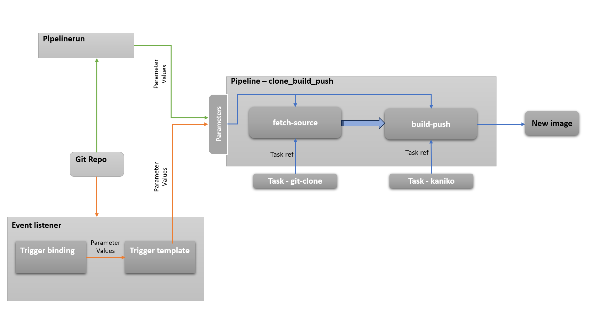

# Overview of Tekton Usecase

## Webapp Application

### Webapp Git Repo

The Webapp git repo contains a simple ***html file*** and a ***Dockerfile*** to copy the html file to the nginx image. It is available [here](https://github.com/surajmohan-m/webapp.git)

### Webapp Deployment and Service

* **Deployment**

  * Name : webapp-deployment
  * image : [webapp-tekton](https://hub.docker.com/repository/docker/surajmohanm/webapp-tekton/generalhttps:/)
  * Port : 80
* Service

  * kubectl expose deployment/webapp-deployment --type="NodePort" --port 80

## Tekton - Build and push Pipeline

* **Pipeline** - clone_build_push
  * **tasks**
    * fetch-source
      * reference task - [git-clone](https://hub.tekton.dev/tekton/task/git-clone)
    * build-push
      * reference task - [kaniko](https://hub.tekton.dev/tekton/task/kaniko)
* **Pipelinerun**
  * **Pipeline** - clone_build_push
