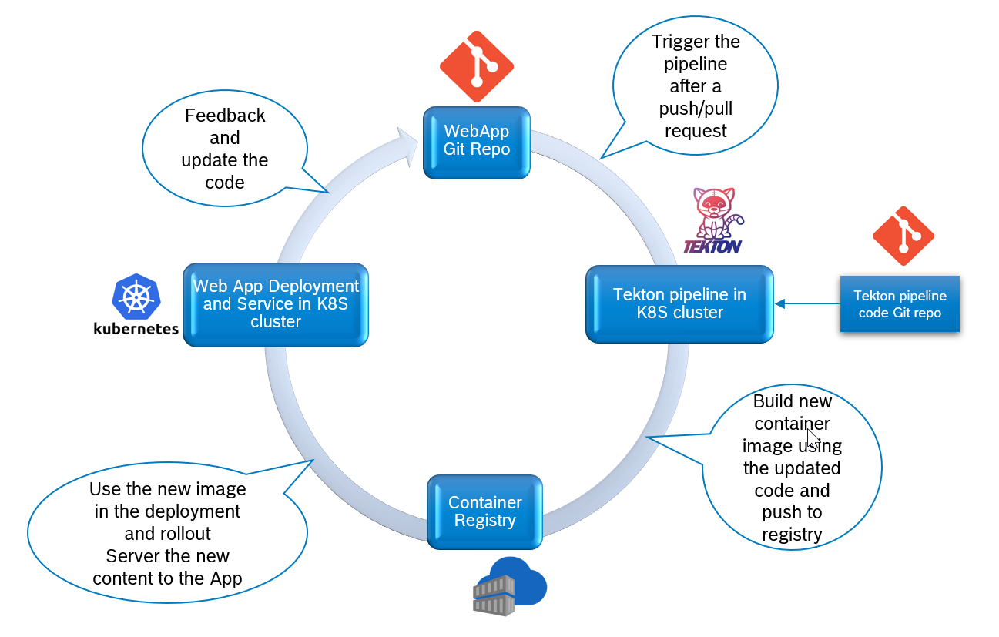
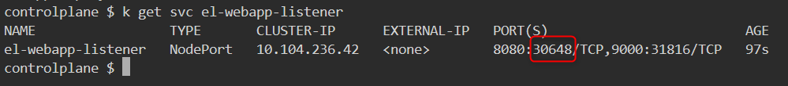
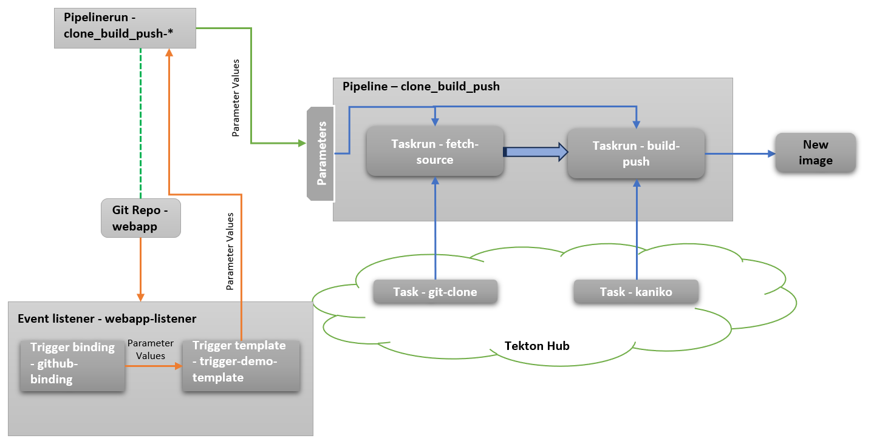

## Overview of Tekton Usecase



## Sample Webapp Application

### Webapp Git Repo

The Webapp git repo contains a simple ***html file*** and a ***Dockerfile*** to copy the html file to the nginx image.

### Webapp Deployment and Service
* Git Repo : [webapp.git](https://github.com/surajmohan-m/webapp.git)
* **Deployment**
  * Name : webapp-deployment
  * image : [webapp-tekton](https://hub.docker.com/r/surajmohanm/webapp-tekton/tags)
  * Port : 80
* **Service**
  * kubectl expose deployment/webapp-deployment --type="NodePort" --port 80

## CI/CD for the Webapp using Tekton

### Install script
A simple installation script is available in this repo which installs all the required resources required for Tekton pipelines in the K8S Cluster.
```
git clone https://github.com/surajmohan-m/tekton_demo.git
cd tekton_demo
chmod 755 setup.sh
./setup.sh
```
Details of the installation steps is described 

#### Test the webhook in Git repo
Get the event listener port in the node
```
kubectl get svc el-webapp-listener
```


 **http://[Node IP]:PORT** is the webhook URL. Update it in Github Repo at **Settings >> Webhooks >>  Payload URL**
Then perform push operation and monitor the event listener log
#### Webapp CI/CD Pipeline Architecture




*  **Internals of Pipelinerun** - clone_build_push-*
    ```
     apiVersion: tekton.dev/v1
      kind: PipelineRun
      metadata:
        generateName: clone-build-push-run-
        .......
        .......
      spec:
        pipelineRef:
          name: clone-build-push
        .......
        .......
        params:
        - name: repo-url
          value: "$(tt.params.repo-url)"
        - name: image-reference
          value: surajmohanm/webapp-tekton
    ```
  *  **Internals Internals of Pipeline** - clone_build_push

 ```
     params:
     - name: repo-url
       type: string
     - name: image-reference
       type: string
       .......
       .......
       tasks:
       - name: fetch-source
         taskRef:
           name: git-clone
        .......
        .......
      - name: build-push
        runAfter: ["fetch-source"]
        taskRef:
          name: kaniko
 ```
 * **Taskrun** - fetch-source
    * **Task** - [git-clone](https://hub.tekton.dev/tekton/task/git-clone)
  * **Taskrun** - build-push
    * **Task** - [kaniko](https://hub.tekton.dev/tekton/task/kaniko)


## Reusing the pipeline

#### This Tekton pipeline can be reused by updating the Yaml files as follows
* Modify  **image** in **webapp/deployment_webapp.yml**
  ```
   containers:
      - name: nginx
        image: docker.io/surajmohanm/webapp-tekton:latest
  ```
* Modify **image-reference** in **Triggers/trigger_template.yml**
   ```
   name: image-reference
          value: surajmohanm/webapp-tekton
   ```
* Modify **config.json** in **auth/docker-credentials.yml**
  * Create docker config file by login to docker using following command. Provide username and password when prompted
    ```
    docker login
    ```
  * Create encoded config.json string
    ```
    cat .docker/config.json |base64
    ```
  * Update **config.json** field in **auth/docker-credentials.yml**
    ```
    apiVersion: v1
    kind: Secret
    metadata:
      name: docker-credentials
    data:
      config.json:[use your encoded config.json here]
    ```
 * **Ingress** configuration for the **webhook**
   
   Need to implement ingress for **event listener** to configure webhook path

  More meaningful names and labels can be given to the resources according to the requirement.
